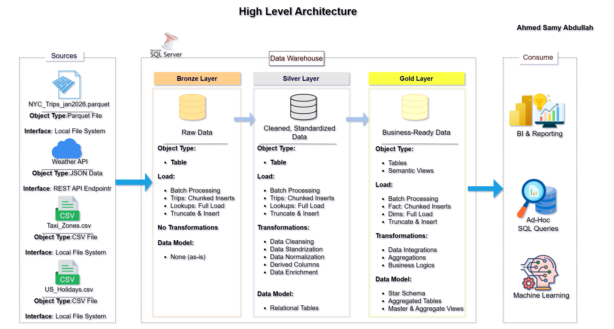
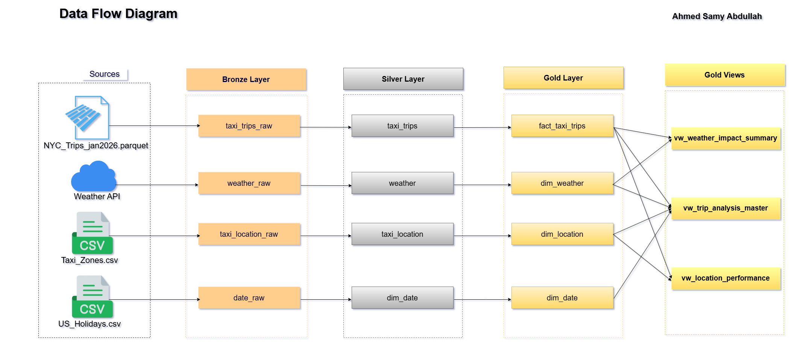
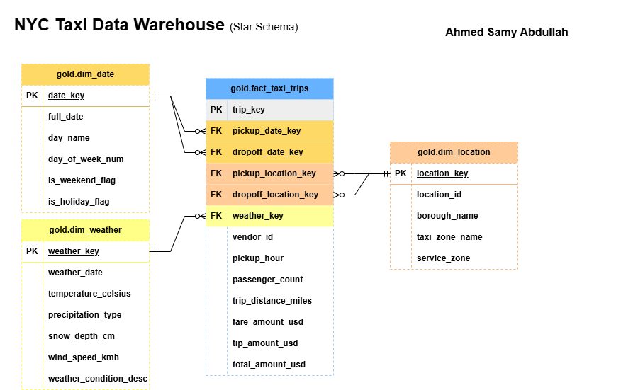

# 🚖 NYC Taxi Data Warehouse & Analytics Pipeline

Welcome to the **NYC Taxi Data Warehouse** repository! This project is a comprehensive, end-to-end Data Engineering pipeline designed to ingest, process, and model over **4 million trip records** from the New York City Taxi and Limousine Commission (NYC TLC). 

By integrating massive volume trip data with external API-driven weather conditions and spatial lookup files, this project showcases the practical implementation of the **Medallion Architecture**, robust ETL workflows, and memory-optimized data processing techniques to deliver a reporting-ready Star Schema for Business Intelligence.

---

## 📊 Dataset & Data Sources
The pipeline integrates multiple disparate data formats into a single centralized Microsoft SQL Server Data Warehouse:
1. **NYC TLC Trip Data (Parquet):** Over 4 million rows representing yellow taxi trips in January 2026. Contains details on pickup/drop-off times, passenger counts, trip distances, and fare breakdowns.
2. **Weather Data (JSON/REST API):** Historical weather data fetched dynamically from the Open-Meteo API, capturing daily temperature, precipitation, snow depth, and wind speed to analyze weather impacts on taxi demand.
3. **Geographical & Time Lookups (CSV):** 
   - `Taxi_Zones.csv`: Mapping location IDs to specific boroughs and service zones.
   - `US_Holidays.csv`: Identifying public holidays to analyze trip volume variations.

*(Note: The full dataset, including the 4M+ rows Parquet file and all lookup CSVs, is available in the **Releases** section of this repository).*

---

## 🏗️ Data Architecture & Pipeline Design
The data pipeline is built on the **Medallion Architecture** to ensure data quality, traceability, and logical separation of transformations. The orchestration and data movement are handled entirely via Python.

### 1. High-Level Architecture

### 2. Data Flow & ETL Processes (Table Lineage)

#### 🥉 Bronze Layer (Raw Data Ingestion)
The landing zone for raw data. The primary goal of this layer is to capture data from source systems "as-is" without applying any business logic or cleansing.
* Extracts `.parquet` files, reads `.csv` lookups, and parses JSON responses from the Weather API.
* Data is loaded into SQL Server staging tables (`taxi_trips_raw`, `weather_raw`, etc.) maintaining historical accuracy and preventing source system overload.

#### 🥈 Silver Layer (Data Cleansing & Standardization)
The integration and cleansing layer where raw data becomes reliable and queryable.
* **Data Cleansing:** Removed anomalous records (e.g., negative fare amounts, trips with zero passenger count, or impossible trip distances).
* **Missing Value Handling:** Addressed NULL values in weather and trip metrics to ensure analytical consistency.
* **Standardization:** Enforced consistent data types, formatted date/time columns, and standardized column naming conventions to `snake_case`.

#### 🥇 Gold Layer (Star Schema & Data Modeling)
The presentation layer optimized for high-performance read queries and business analytics. 
* Modeled using the **Kimball Methodology** to create a structured **Star Schema**.
* **Dimensions:** Generated `dim_date`, `dim_weather`, and `dim_location` loaded via Full Load strategies.
* **Fact Table:** Created `fact_taxi_trips` linking dimensions via Foreign Keys. Due to the massive data volume, this table was populated using **Chunked Inserts** to optimize memory utilization.

#### 💎 Semantic Layer (Analytical Views)
Business-ready analytical views that denormalize the Star Schema to serve direct BI dashboard connections and Ad-Hoc queries.
* `vw_trip_analysis_master`: A comprehensive flattened view of all trip details.
* `vw_weather_impact_summary`: Aggregates trip volumes and average fares against specific weather conditions (e.g., rain, snow).
* `vw_location_performance`: Analyzes pickup/drop-off volumes per borough and zone.

### 3. Entity-Relationship Diagram (ERD)

---

## 🚀 Engineering Challenges & Solutions

Building an end-to-end Data Warehouse pipeline for 4M+ records on local hardware presented several real-world Data Engineering challenges:

### 1. Memory Limits & Out-of-Memory (OOM) Errors
* **The Problem:** Attempting to perform a Full Load of a 4-million-row Parquet file directly into SQL Server using a machine with 16GB RAM caused memory exhaustion and script crashes (`MemoryError`). 
* **The Solution:** Implemented **Chunked Processing**. Using Pandas and SQLAlchemy, the ingestion script was re-engineered to process the data in batches using `chunksize=10000`. This allowed the pipeline to stream data sequentially into the database, keeping memory consumption stable and predictable.

### 2. Slow Data Ingestion & I/O Bottlenecks
* **The Problem:** Even with chunking, the default SQLAlchemy insertion method executes row-by-row `INSERT` statements. This resulted in excessive network round-trips and severe I/O bottlenecks, making the load process unreasonably slow.
* **The Solution:** Applied **Performance Tuning** at the connection level. 
  1. Enabled `fast_executemany=True` in the SQLAlchemy `pyodbc` engine configuration, converting slow individual inserts into highly optimized bulk inserts.
  2. Performed rigorous chunk size tuning. Testing revealed that a `chunksize` of 10,000 provided the optimal balance between maximizing network throughput and preventing database transaction log overload.

### 3. Data Format Integration & Disparate Sources
* **The Problem:** The pipeline required merging completely different data structures: hierarchical JSON from a REST API (Weather data), compressed columnar data (Parquet for trips), and flat text files (CSV for lookups).
* **The Solution:** Built a flexible Extraction Pipeline in the **Bronze Layer** using Python. Utilized the `requests` library to fetch and flatten the JSON API responses into DataFrames. By standardizing all extractions into Pandas DataFrames first, the pipeline seamlessly unified these diverse formats into a single SQL Server staging environment.

### 4. Dirty Data & Anomalous Records
* **The Problem:** The raw TLC dataset contained impossible values that would skew analytical views (e.g., negative trip distances, negative fare amounts, and zero passenger counts) as well as NULL values in spatial lookups.
* **The Solution:** Developed a robust **Silver Layer** (Cleansing Layer). Python transformation scripts were written to enforce strict business rules: filtering out invalid metrics (`distance > 0`, `fare > 0`), imputing or dropping missing dimension keys, and standardizing all schema columns to `snake_case` for downstream consistency.

### 5. Referential Integrity Constraint Violations
* **The Problem:** The Gold Layer is modeled as a Star Schema. Loading the massive `fact_taxi_trips` table before its corresponding dimensions would violate Foreign Key constraints, causing the SQL Server to reject the transaction.
* **The Solution:** Designed a strict **ETL Orchestration Workflow**. The pipeline was hardcoded to enforce a sequential load strategy: all Dimension tables undergo a Full Load first. Only upon successful dimension population does the Fact table chunked insertion begin, guaranteeing 100% referential integrity.

---

## 🛠️ Technology Stack
* **Programming Language:** Python (Pandas, Requests, SQLAlchemy, pyodbc)
* **Database Management:** Microsoft SQL Server (T-SQL)
* **Data Formats:** Parquet, JSON, CSV
* **Architecture & Modeling:** Medallion Architecture, Star Schema (Kimball)
* **Design Tools:** Draw.io (DFD & ERD)

---

## 🛣️ Project Roadmap & Execution Checklist

### 🔍 1. Requirements & Source Analysis
✅ Analyze NYC TLC Parquet Data Structure.  
✅ Connect and extract data from Open-Meteo REST API.  
✅ Gather Lookup CSV data (Zones, Holidays).  

### 📐 2. Design Data Architecture
✅ Design Medallion Architecture (Bronze, Silver, Gold).  
✅ Draft Data Flow Diagram (DFD) for the pipeline.  
✅ Draft Entity-Relationship Diagram (ERD) for the Star Schema.  

### 🛠️ 3. Project Workspace
✅ Create GitHub Repository & configure `.gitignore`.  
✅ Setup Python Virtual Environment and dependencies.  

### 🥉 4. Build Bronze Layer (Extraction)
✅ Extract Parquet, CSV, and API data using Pandas.  
✅ Load Raw Data into SQL Server using `fast_executemany`.  

### 🥈 5. Build Silver Layer (Transformation)
✅ Cleanse Data (Filter anomalous trip distances and fares).  
✅ Handle missing values and anomalies in Weather and Trip Data.  
✅ Standardize column names to `snake_case`.  
✅ Data Type Casting and formatting.  

### 🥇 6. Build Gold Layer (Data Modeling)
✅ Generate Surrogate Keys and Foreign Key relationships.  
✅ Load Dimension Tables (Full Load).  
✅ Load Fact Table (Incremental / Chunked Inserts).  

### 💎 7. Semantic Layer & Analytics
✅ Create `vw_trip_analysis_master` for BI Reporting.  
✅ Create `vw_weather_impact_summary` to correlate trips with weather conditions.  
✅ Create `vw_location_performance` for spatial analysis.  

---

## 🛡️ License
This project is licensed under the MIT License - see the [LICENSE](LICENSE) file for details.

## 👨‍💻 About Me
Hello, I'm **Ahmed Samy Abdullah Ali**, an Engineering Student specializing in Communications and Electronics, and an aspiring **Data Engineer**. 

I am deeply focused on database architectures, data modeling, and building automated ETL data pipelines. I work with tools like Python, SQL, and data processing libraries to build structured, reliable, and scalable data solutions. This project represents a practical implementation of memory management, dimensional modeling, and end-to-end data pipeline orchestration.

Let's connect and talk about Data! 🚀

 
 

